# Mandelbrot by Jort, Mandelbrot set viewer written in Rust
    __  __                 _      _ _               _   
    |  \/  |               | |    | | |             | |  
    | \  / | __ _ _ __   __| | ___| | |__  _ __ ___ | |_ 
    | |\/| |/ _` | '_ \ / _` |/ _ \ | '_ \| '__/ _ \| __|
    | |  | | (_| | | | | (_| |  __/ | |_) | | | (_) | |_ 
    |_|  |_|\__,_|_| |_|\__,_|\___|_|_.__/|_|  \___/ \__|
       __             __         __ 
      / /  __ __  __ / /__  ____/ /_
     / _ \/ // / / // / _ \/ __/ __/
    /_.__/\_, /  \___/\___/_/  \__/ 
         /___/                      v1.2
         
---
- [Running](#running)
- [Usage](#usage)
- [Controls](#controls)
- [Screenshots](#screenshots)
- [Wallpapers](#wallpapers)
---

## Running
## 1. [Install Rust](https://www.rust-lang.org/tools/install)
On Linux:
```
curl --proto '=https' --tlsv1.2 -sSf https://sh.rustup.rs | sh
```
### 2. Run Mandelbrot by Jort using `cargo run` in the root of the repository
```
cargo run --release
```

## Usage
<pre>
    
__  __                 _      _ _               _   
|  \/  |               | |    | | |             | |  
| \  / | __ _ _ __   __| | ___| | |__  _ __ ___ | |_ 
| |\/| |/ _` | '_ \ / _` |/ _ \ | '_ \| '__/ _ \| __|
| |  | | (_| | | | | (_| |  __/ | |_) | | | (_) | |_ 
|_|  |_|\__,_|_| |_|\__,_|\___|_|_.__/|_|  \___/ \__|
   __             __         __ 
  / /  __ __  __ / /__  ____/ /_
 / _ \/ // / / // / _ \/ __/ __/
/_.__/\_, /  \___/\___/_/  \__/ 
     /___/                      v1.2


Run Mandelbrot using:
	cargo run --release -- &lt;width&gt; &lt;height&gt; &lt;max_iterations&gt; &lt;supersampling_amount&gt; &lt;window_scale&gt;
where &lt;arg&gt; means substitute with the value of arg
use '-' to use the default value of arg

KeyBindings {
    Up -> Move up translation_amount pixels,
    Down -> Move down translation_amount pixels,
    Left -> Move left translation_amount pixels,
    Right -> Move right translation_amount pixels,
    R -> Reset the Mandelbrot set view to the starting view,
    NumPadPlus -> Increment translation_amount,
    NumPadMinus -> Decrement translation amount,
    NumPadAsterisk -> Increment scale_numerator,
    NumPadSlash -> Decrement scale_numerator,
    LeftBracket -> Scale the view by scaling_factor, effectively zooming in,
    RightBracket -> Scale the view by inverse_scaling_factor, effectively zooming out,
    C -> Prints the current Mandelbrot set view; the center and scale,
    Key1 -> Renders VIEW_1,
    Key2 -> Renders VIEW_2,
    Key3 -> Renders VIEW_3,
    Key4 -> Renders VIEW_4,
    Key5 -> Renders VIEW_5,
    Key6 -> Renders VIEW_6,
    Key7 -> Renders VIEW_7,
    Key8 -> Renders VIEW_8,
    Key9 -> Renders VIEW_9,
    K -> Prints the keybindings,
    S -> Saves the current Mandelbrot set view as an image in the saved folder,
    I -> Manually input a Mandelbrot set view,
    A -> Pick an algorithm to color the Mandelbrot set view,
    M -> Change the Mandelbrot set view max_iterations,
}

</pre>
## Controls
Keys | Action
:---:|:------
<kbd>↑</kbd>, <kbd>↓</kbd>, <kbd>←</kbd>, <kbd>→</kbd> | Move up, down, left, or right
<kbd>R</kbd> | Reset the Mandelbrot set view to the starting view
<kbd>[</kbd> | Zoom in
<kbd>]</kbd> | Zoom out
<kbd>C</kbd> | Prints the current Mandelbrot set view; the center and scale
<kbd>0</kbd>, ...,  <kbd>9</kbd> | Render a preconfigured view
<kbd>K</kbd> | Print the keybindings 
<kbd>S</kbd> | Saves the current Mandelbrot set view as an image
<kbd>I</kbd> | Manually input a Mandelbrot set view
<kbd>A</kbd> | Pick an algorithm to color the Mandelbrot set view
<kbd>M</kbd> | Change the Mandelbrot set view max_iterations
<kbd>ESC</kbd>, <kbd>CTRL</kbd>+<kbd>C</kbd> | Exit

## Screenshots
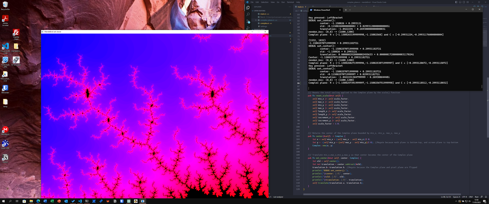
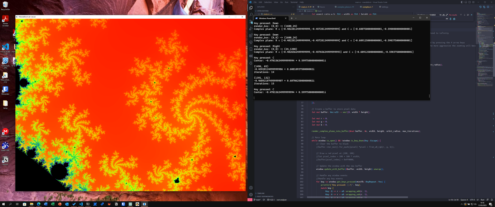
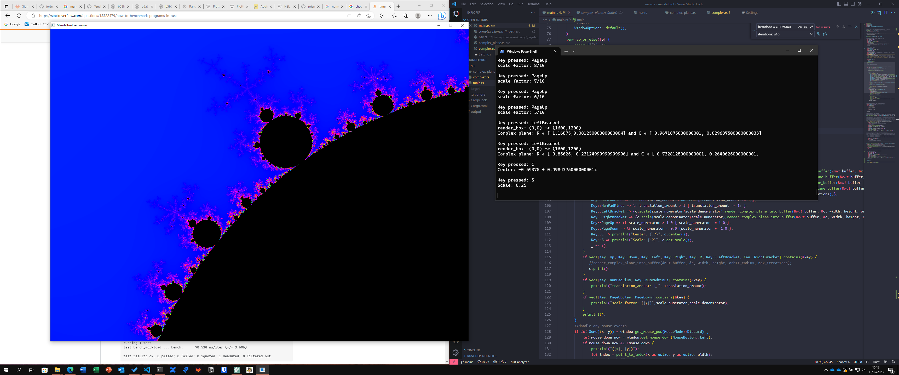
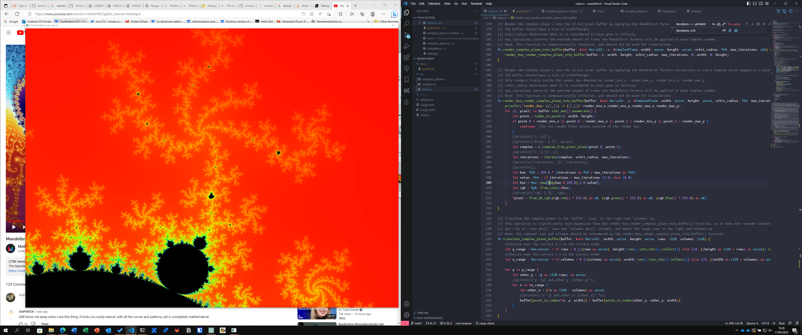
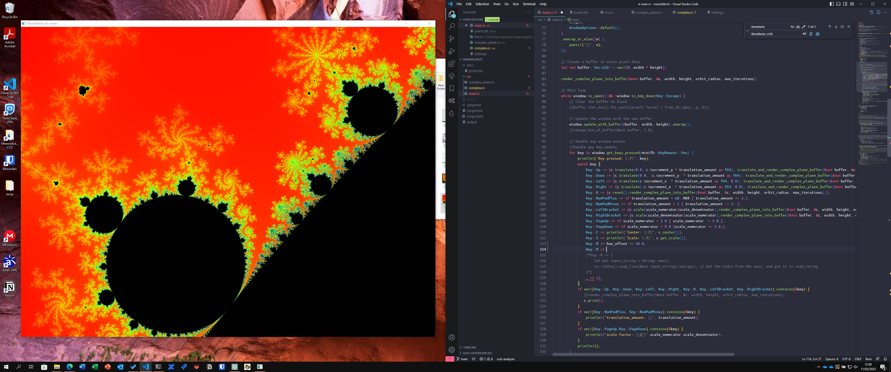
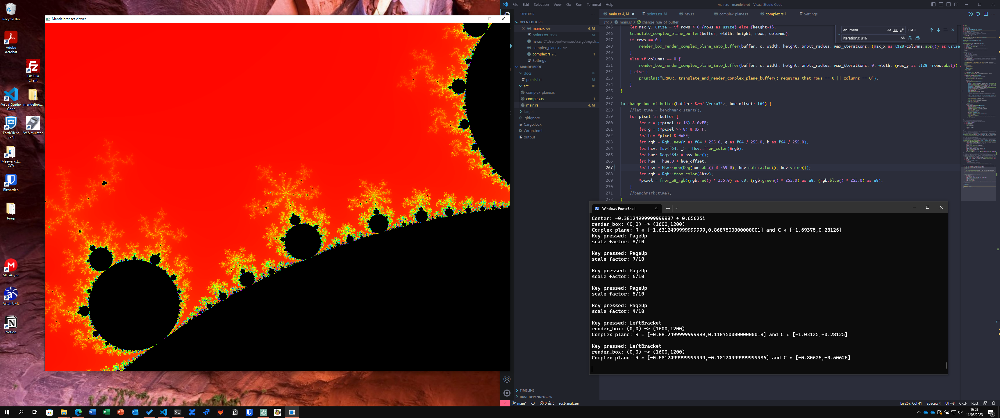
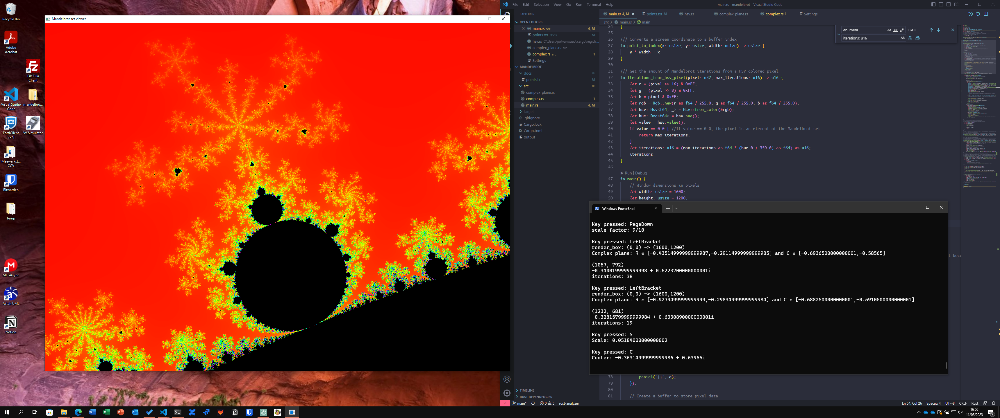
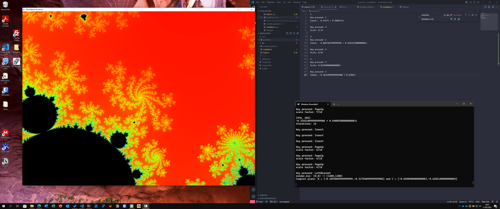
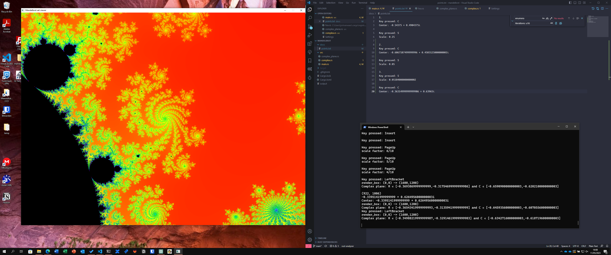
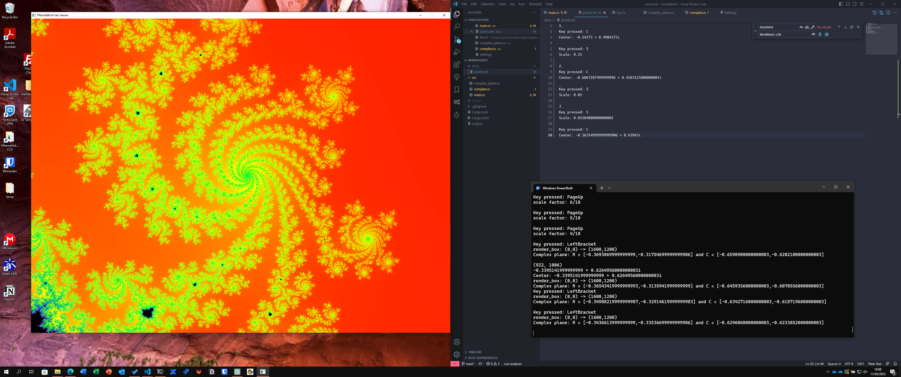
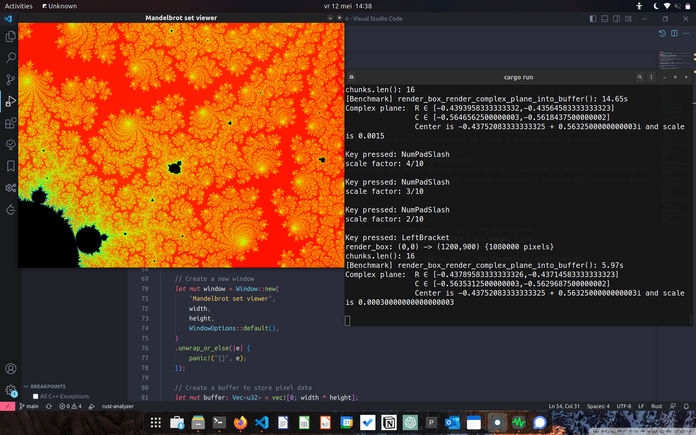
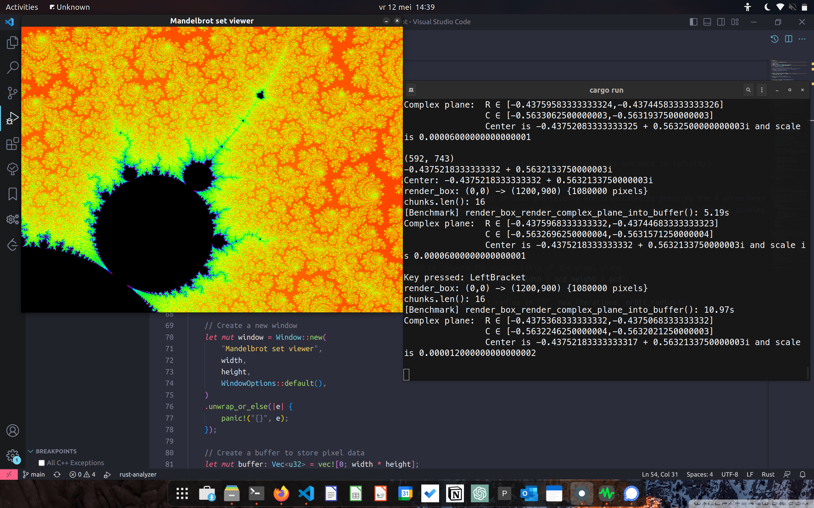

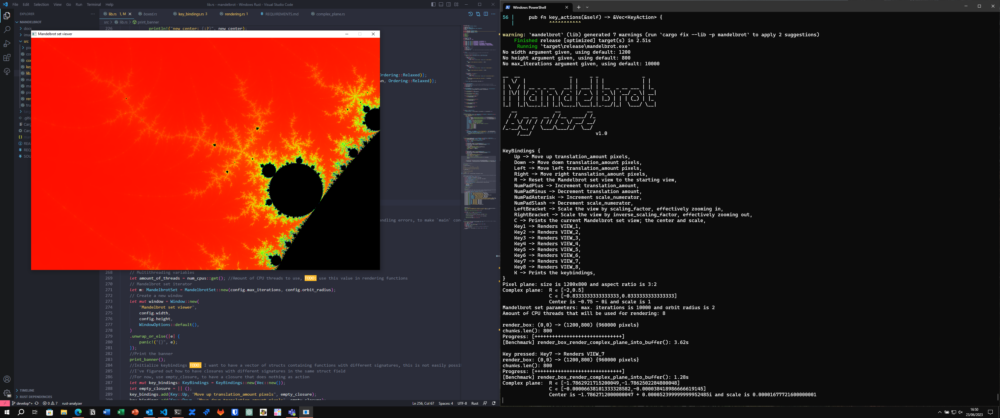


## Wallpapers
### 3440x1440


### 2560x1600


### 1170x2532 (Iphone 13)

